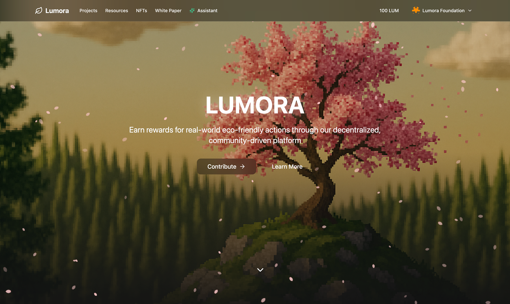

# 🌱 Lumora

<br />
<div align="center">
  <a href="https://github.com/zinct/lumora">
    
  </a>
  <h3 align="center">Lumora - Decentralized Eco-Action & Reward Platform</h3>
  <p align="center">
     Lumora is a fully on-chain eco-action platform that empowers users to submit and verify real-world environmental projects through community voting. Verified actions are rewarded with $LUM tokens (ICRC1/2), while NFT achievements (ICRC7), AI chatbot support, face recognition, and storage canister for image proof enhance the experience with transparency and trust.
  </p>
</div>

## 📌 Why Lumora?

In the face of climate change, environmental action is more important than ever. Lumora introduces a novel way to encourage eco-friendly behavior through token rewards, NFT incentives, and transparent verification systems—all on-chain. Communities can organize environmental projects and reward participants, while individuals can contribute and earn tokens for their real-world impact.

## 📚 Complete Resources

- Mainnet: https://vhtak-4yaaa-aaaam-aejya-cai.icp0.io/
- Pitch Deck: https://www.canva.com/design/DAGmaChTRQg/r4ECbK6TqtN8v37RNsSMPw/edit?utm_content=DAGmaChTRQg&utm_campaign=designshare&utm_medium=link2&utm_source=sharebutton
- White Paper: https://www.notion.so/Lumora-White-Paper-1eaa9c3ab182805bab79cbae7fe8ad7c?showMoveTo=true&saveParent=true

## 🌟 Features of Lumora

### Eco-Action Project System (On-Chain)

- Communities can create environmental projects.
- Define rewards, participation period, and manage contributions.
- Verified on-chain for transparency and traceability.

### Token Reward-Based Participation (ICRC1 & ICRC2)

- Participants receive $LUM tokens after completing verified actions.
- Rewards are fixed and distributed on-chain.
- $LUM tokens can be imported into any wallet supporting ICRC1/2.

### NFT Collections (ICRC7)

- Redeem your earned $LUM tokens for unique NFTs.
- Each NFT symbolizes your eco-contribution and is stored on-chain.

### Face Recognition Verification (On-Chain)

- Ensures user authenticity and prevents abuse.
- Biometric identity is verified securely using canister-based services.

### Eco-Action Assistant

- Get AI-powered support to generate ideas for your eco-projects.
- Designed to help communities and individuals take meaningful steps.

## 🏆 What We Are Proud Of

- Fully on-chain reward system using ICRC1 and ICRC2 standard tokens.
- NFT redemption system supporting ICRC7, symbolizing eco-impact.
- Community-driven approval for participation and proof validation.
- AI-powered Eco-Action Assistant to help generate eco-project ideas.
- Face recognition system for secure identity verification.
- Secure reward and identity verification using Internet Identity (II).
- Storage canister integration for immutable image-based evidence.

## Getting Started

### 🔧 Clone the repository:

```sh
git clone https://github.com/zinct/lumora.git
```

### 📦 Install Dependencies:

```sh
cd lumora
npm install
```

### 🛠 Setup Application:

- Deploy applications

  ```sh
   dfx deploy
  ```

- Run build script

  ```sh
   ./script/setup.sh
  ```

## Created by Lumora Team

- Indra Mahesa (Developer)
- Audri Mona Najogi (UI/UX Designer)
- Wildan Syukri Niam (Developer)
